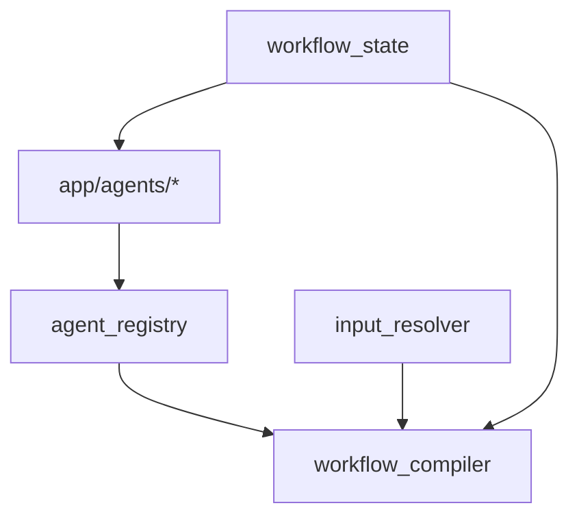
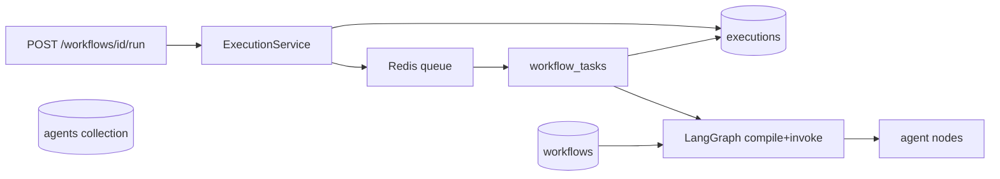
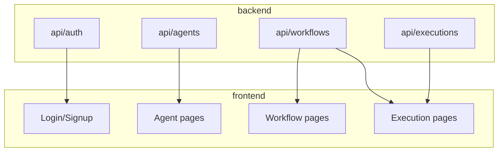
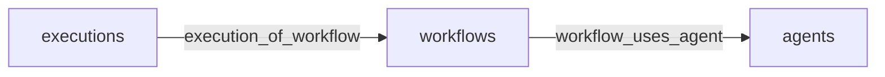

# Dependency graph (visual)

Read with [`dependencies.yaml`](./dependencies.yaml) for file paths and impact lists.

## Layer 0 — Infrastructure

```mermaid
flowchart TB
  arango[(ArangoDB)]
  redis[(Redis)]
  ls[LangSmith optional]

  arango --> users[users]
  arango --> agents[agents]
  arango --> workflows[workflows]
  arango --> executions[executions]
  arango --> graph[graph edges]

  redis --> celery[Celery worker]
```

## Layer 1 — Core



## Layer 2 — Run path (critical)



## Layer 3 — API → UI



## Graph edges (Arango)



**Changing `agents.slug`:** breaks workflow definitions, registry, graph edges, compiler validation.

**Changing `definition.steps`:** requires `workflow_edges` resync + compiler + worker.

## Hot paths (most coupled)

| Change here | Ripples to |
|-------------|------------|
| `workflow_compiler` | worker, workflow CRUD, all runs |
| `agent_registry` + new agent file | seed, compiler validate, graph edges, UI agent list |
| `executions` schema | worker, execution API, agent detail stats, UI execution page |
| `workflow_tasks` | run API, all execution status UX |
| `AuthService` / JWT | every protected route + UI |

Use [CHANGE_IMPACT.md](./CHANGE_IMPACT.md) for a checklist.
