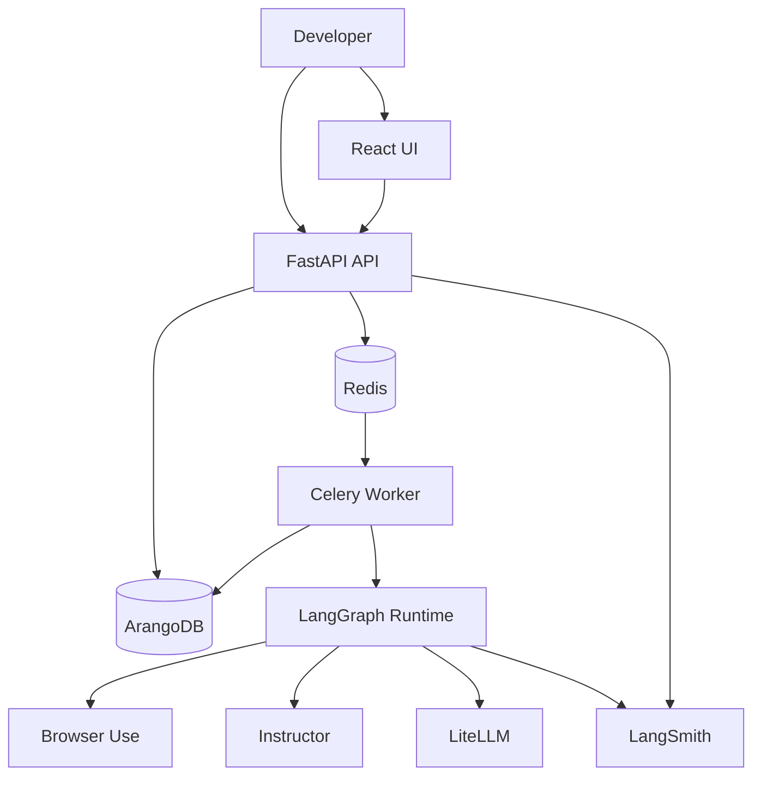
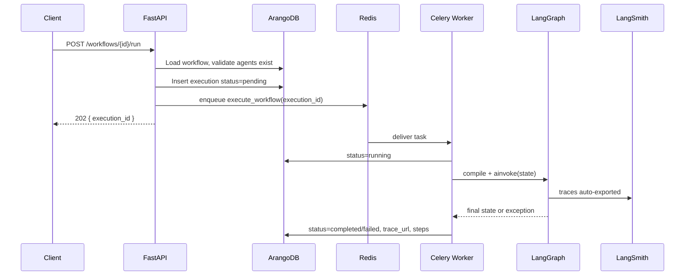
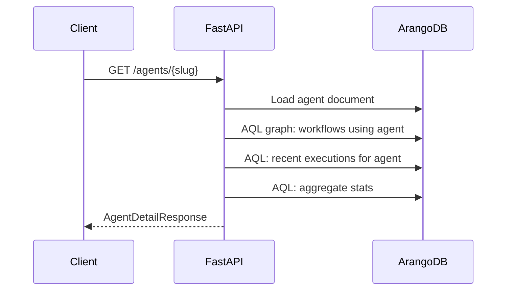

# Orqis MVP — System Design Document

**Version:** 1.0  
**Status:** Implementation-ready  
**Aligns with:** [`../product/orqis.md`](../product/orqis.md), [`../planning/orqis_implementation_plan.md`](../planning/orqis_implementation_plan.md)

This document is the **single source of truth** for implementing the Concept MVP. A developer should be able to build the system end-to-end from this spec without guessing.

---

## Table of Contents

1. [Purpose & Success Criteria](#1-purpose--success-criteria)
2. [High-Level Design](#2-high-level-design)
3. [Technology Choices](#3-technology-choices)
4. [Low-Level Architecture](#4-low-level-architecture)
5. [ArangoDB Data Model](#5-arangodb-data-model)
6. [Redis & External Systems](#6-redis--external-systems)
7. [Workflow State & Orchestration](#7-workflow-state--orchestration)
8. [Backend Module Design](#8-backend-module-design)
9. [Class & Interface Reference](#9-class--interface-reference)
10. [API Specification](#10-api-specification)
11. [Celery Worker Design](#11-celery-worker-design)
12. [Agent Implementations](#12-agent-implementations)
13. [Frontend Design](#13-frontend-design)
14. [Folder Structure](#14-folder-structure)
15. [Configuration & Environment](#15-configuration--environment)
16. [Docker & Deployment](#16-docker--deployment)
17. [Security](#17-security)
18. [Error Handling](#18-error-handling)
19. [Testing Strategy](#19-testing-strategy)
20. [Seed Data & Examples](#20-seed-data--examples)
21. [Implementation Order](#21-implementation-order)

---

## 1. Purpose & Success Criteria

### 1.1 Goal

Prove that Orqis can:

1. Store **agent metadata** and **workflow metadata** in **ArangoDB** (documents + graph edges for reuse).
2. **Orchestrate** first-party agents in workflows via **LangGraph** (Layer 1).
3. Run **internal agent loops** via Browser Use / Instructor / LiteLLM (Layer 2).
4. Expose **everything about an agent** (definition, workflows using it, run history, failures, LangSmith links).
5. **Reuse** the same agent `slug` across multiple workflows.

### 1.2 Out of scope

- External agent onboarding (`POST /agents` public registration)
- No-code workflow UI
- Marketplace, billing, SSO, on-prem
- Native replacement of LangSmith UI

### 1.3 Acceptance checklist

- [ ] ArangoDB contains seeded agents and 2+ workflows sharing `browser-agent`
- [ ] `GET /api/agents/browser-agent` returns definition, `workflows_using`, `stats`, `recent_executions`
- [ ] `POST /api/workflows/{id}/run` enqueues Celery job; execution reaches `completed` or `failed`
- [ ] Failed execution has `failed_step_id`, `failed_agent_slug`, `error`
- [ ] `langsmith_trace_url` populated when tracing enabled
- [ ] Graph query: workflows using agent X matches workflow definitions

---

## 2. High-Level Design

### 2.1 System context



### 2.2 Responsibility split

| Component | Responsibility |
|-----------|----------------|
| **ArangoDB** | All platform **metadata** and **operational records**: users, agents, workflows, executions; **graph edges** for agent↔workflow reuse |
| **Redis** | Celery broker + result backend (MVP) |
| **FastAPI** | Auth, CRUD, enqueue runs, read models, agent enrichment queries |
| **Celery worker** | Compile workflow, run LangGraph, update execution document |
| **LangGraph** | Layer 1 orchestration (step order, shared state) |
| **Agent wrappers** | Layer 2 delegation to Browser Use / Instructor / LiteLLM |
| **LangSmith** | Deep traces (workflow graph + agent internals) |
| **React UI** | Operational views only |

### 2.3 Request flows

#### Run workflow (happy path)



#### Agent detail (read model)



---

## 3. Technology Choices

### 3.1 Why ArangoDB for metadata (and MVP data)

| Requirement | ArangoDB fit |
|-------------|--------------|
| Agent & workflow **metadata** (schemas, config, versions) | Document collections with flexible JSON |
| **“Which workflows use agent X?”** | Native **graph** edges `workflow_uses_agent` |
| **Reuse proof** | Traverse edges without ad hoc joins |
| Single DB for MVP | Users, workflows, executions in same store |
| Future onboarding | Graph can link `user_owns_agent`, `agent_depends_on` |

### 3.2 What is NOT stored in ArangoDB

| Data | Store | Reason |
|------|-------|--------|
| Full LangSmith spans | LangSmith SaaS | Specialized trace product |
| Celery tasks | Redis | Queue semantics |
| LLM prompts/responses (raw) | LangSmith | Size + privacy; MVP links only |
| Large binary artifacts (screenshots) | **Phase 2** object storage | MVP: optional small base64 in state or skip |

### 3.3 Execution output size policy (MVP)

- `executions.output_data` and per-step summaries: max **256 KB** JSON per execution (truncate with flag `truncated: true`).
- Full payloads remain recoverable from LangSmith when traced.

### 3.4 Stack summary

| Layer | Technology | Version (pin in implementation) |
|-------|------------|----------------------------------|
| API | FastAPI | ≥0.110 |
| Worker | Celery | ≥5.3 |
| DB | ArangoDB | ≥3.11 |
| Queue | Redis | ≥7 |
| Orchestration | LangGraph | ≥0.2 |
| Tracing | LangSmith + langsmith SDK | latest stable |
| LLM | LiteLLM | ≥1.40 |
| Browser agent | browser-use | latest compatible |
| Extractor | instructor | ≥1.0 |
| Frontend | React + Vite | React 19 |
| Auth | JWT (HS256) | python-jose |

---

## 4. Low-Level Architecture

### 4.1 Backend layers

```
┌─────────────────────────────────────────────────────────┐
│ api/routers          HTTP, auth deps, status codes       │
├─────────────────────────────────────────────────────────┤
│ schemas/             Pydantic request/response DTOs      │
├─────────────────────────────────────────────────────────┤
│ services/            Business logic, orchestration       │
├─────────────────────────────────────────────────────────┤
│ repositories/        ArangoDB AQL + CRUD                 │
├─────────────────────────────────────────────────────────┤
│ core/                compiler, registry, config, security│
├─────────────────────────────────────────────────────────┤
│ agents/              LangGraph node callables (Layer 2)  │
├─────────────────────────────────────────────────────────┤
│ tasks/               Celery entrypoints                  │
└─────────────────────────────────────────────────────────┘
```

### 4.2 Process model

| Process | Port | Role |
|---------|------|------|
| `orqis-api` | 8000 | HTTP |
| `orqis-worker` | — | Celery consumer |
| `arangodb` | 8529 | Database |
| `redis` | 6379 | Broker |
| `orqis-ui` | 5173 | Vite dev / static prod |

### 4.3 Id conventions

| Entity | ID format | Example |
|--------|-----------|---------|
| Arango document `_key` | UUID4 string | `a1b2c3d4-...` |
| Agent slug | kebab-case, unique | `browser-agent` |
| Workflow slug | kebab-case, unique per user | `competitor-intel` |
| Step id | kebab-case, unique per workflow | `scrape` |
| Execution | `_key` UUID | — |

---

## 5. ArangoDB Data Model

### 5.1 Collections overview

| Collection | Type | Purpose |
|------------|------|---------|
| `users` | document | Auth identity |
| `agents` | document | Agent metadata + schemas |
| `workflows` | document | Workflow definitions |
| `executions` | document | Run records |
| `workflow_uses_agent` | **edge** | Graph: workflow → agent (per step) |
| `execution_of_workflow` | **edge** | Graph: execution → workflow |

### 5.2 Database and graphs

- **Database name:** `orqis`
- **Named graph:** `orqis_graph`
  - Vertex collections: `users`, `agents`, `workflows`, `executions`
  - Edge collections: `workflow_uses_agent`, `execution_of_workflow`

### 5.3 Document schemas

#### `users`

```json
{
  "_key": "uuid",
  "email": "user@example.com",
  "password_hash": "$2b$...",
  "display_name": "Nik",
  "created_at": "2026-06-01T12:00:00Z",
  "updated_at": "2026-06-01T12:00:00Z",
  "is_active": true
}
```

**Indexes:** `unique_hash_index` on `email`.

---

#### `agents` (metadata — source of truth for platform agents)

```json
{
  "_key": "uuid",
  "slug": "browser-agent",
  "name": "Browser Agent",
  "version": "1.0.0",
  "description": "Navigates websites and extracts raw content via Browser Use.",
  "status": "active",
  "owner": "system",
  "implementation": {
    "type": "python",
    "entrypoint": "app.agents.browser:run",
    "framework": "browser-use",
    "module": "browser_use"
  },
  "category": "automation",
  "tags": ["web", "scrape"],
  "input_schema": {
    "$schema": "https://json-schema.org/draft/2020-12/schema",
    "type": "object",
    "properties": {
      "urls": { "type": "array", "items": { "type": "string", "format": "uri" } },
      "browser_task": { "type": "string" }
    }
  },
  "output_schema": {
    "type": "object",
    "properties": {
      "raw_content": { "type": "string" }
    },
    "required": ["raw_content"]
  },
  "config_schema": {
    "type": "object",
    "properties": {
      "model": { "type": "string", "default": "gpt-4o" },
      "timeout_seconds": { "type": "integer", "default": 300 }
    }
  },
  "default_config": {
    "model": "gpt-4o",
    "timeout_seconds": 300
  },
  "created_at": "2026-06-01T12:00:00Z",
  "updated_at": "2026-06-01T12:00:00Z"
}
```

**Indexes:**

- `unique` on `slug`
- `persistent` on `status`, `category`

**Rules:**

- MVP: only `owner: "system"` agents (seeded).
- `slug` immutable after create (Phase 2: versioning).

---

#### `workflows`

```json
{
  "_key": "uuid",
  "user_id": "users/uuid",
  "slug": "competitor-intel",
  "name": "Competitor Intelligence",
  "description": "Scrape → extract → analyze competitor pages.",
  "version": 1,
  "status": "active",
  "is_template": true,
  "definition": {
    "schema_version": "1.0",
    "inputs": {
      "urls": { "type": "array", "items": "string", "required": true },
      "email": { "type": "string", "required": false }
    },
    "state_keys": [
      "urls", "email", "raw_content", "structured_data", "analysis", "report"
    ],
    "steps": [
      {
        "id": "scrape",
        "agent": "browser-agent",
        "config": { "model": "gpt-4o" },
        "inputs": {
          "urls": "{{ state.urls }}",
          "browser_task": "Extract pricing and plan names from each URL."
        },
        "on_error": "fail"
      },
      {
        "id": "extract",
        "agent": "extractor",
        "config": {},
        "inputs": {},
        "on_error": "fail"
      },
      {
        "id": "analyze",
        "agent": "analyzer",
        "config": { "model": "gpt-4o" },
        "inputs": {},
        "on_error": "fail"
      }
    ]
  },
  "created_at": "2026-06-01T12:00:00Z",
  "updated_at": "2026-06-01T12:00:00Z"
}
```

**Indexes:**

- `unique` compound: `user_id` + `slug` (via persistent index on `["user_id","slug"]` with unique)
- `persistent` on `user_id`

**On create/update:** service layer syncs `workflow_uses_agent` edges (see §5.4).

---

#### `executions`

```json
{
  "_key": "uuid",
  "user_id": "users/uuid",
  "workflow_id": "workflows/uuid",
  "workflow_slug": "competitor-intel",
  "workflow_version": 1,
  "status": "pending",
  "trigger": "api",
  "input_data": {
    "urls": ["https://example.com/pricing"],
    "email": "team@example.com"
  },
  "output_data": {},
  "langsmith": {
    "trace_url": "https://smith.langchain.com/o/.../runs/...",
    "run_id": "optional-run-id",
    "project": "orqis-mvp"
  },
  "failed_step_id": null,
  "failed_agent_slug": null,
  "error": null,
  "step_summaries": [
    {
      "step_id": "scrape",
      "agent": "browser-agent",
      "status": "completed",
      "started_at": "2026-06-01T12:01:00Z",
      "completed_at": "2026-06-01T12:01:45Z",
      "duration_ms": 45000,
      "error": null
    }
  ],
  "started_at": "2026-06-01T12:01:00Z",
  "completed_at": null,
  "duration_ms": null,
  "celery_task_id": "celery-uuid",
  "created_at": "2026-06-01T12:01:00Z",
  "updated_at": "2026-06-01T12:01:00Z"
}
```

**Status enum:** `pending` | `running` | `completed` | `failed` | `cancelled`

**Indexes:**

- `persistent` on `workflow_id`, `user_id`, `status`, `created_at`
- `persistent` on `step_summaries[*].agent` — *optional*; MVP can filter in app layer

---

### 5.4 Edge schemas

#### `workflow_uses_agent`

- **From:** `workflows/{workflow_key}`
- **To:** `agents/{agent_key}` (resolve by `slug` at sync time)
- **Edge document:**

```json
{
  "_key": "uuid",
  "step_id": "scrape",
  "step_order": 0,
  "agent_slug": "browser-agent",
  "config_snapshot": { "model": "gpt-4o" }
}
```

**Sync algorithm** (`WorkflowService.sync_agent_edges`):

1. Delete all outgoing `workflow_uses_agent` from workflow vertex.
2. For each step in `definition.steps`, resolve agent by `slug`, insert edge with `step_id`, `step_order`.

#### `execution_of_workflow`

- **From:** `executions/{execution_key}`
- **To:** `workflows/{workflow_key}`
- Created once when execution document is inserted.

---

### 5.5 AQL queries (reference implementations)

#### Workflows using agent (by slug)

```aql
FOR agent IN agents
  FILTER agent.slug == @agent_slug
  FOR v, e IN 1..1 INBOUND agent workflow_uses_agent
    RETURN {
      workflow_id: v._key,
      slug: v.slug,
      name: v.name,
      step_id: e.step_id,
      step_order: e.step_order
    }
```

#### Recent executions involving agent

```aql
FOR ex IN executions
  FILTER ex.user_id == @user_id
  FILTER ex.step_summaries[*].agent ANY == @agent_slug
  SORT ex.created_at DESC
  LIMIT @limit
  RETURN ex
```

#### Agent run stats (30-day window, MVP simple)

```aql
LET runs = (
  FOR ex IN executions
    FILTER ex.step_summaries[*].agent ANY == @agent_slug
    FILTER ex.created_at >= @since
    RETURN ex
)
RETURN {
  total_runs: LENGTH(runs),
  completed: LENGTH(FOR r IN runs FILTER r.status == "completed" RETURN 1),
  failed: LENGTH(FOR r IN runs FILTER r.status == "failed" RETURN 1)
}
```

---

### 5.6 ArangoDB initialization script

File: `backend/scripts/init_arangodb.py`

1. Create database `orqis` if missing.
2. Create document collections with schemas (validator optional).
3. Create edge collections.
4. Create named graph `orqis_graph`.
5. Create indexes listed above.
6. Run seed (§20).

Use `python-arango` async or sync (MVP: sync in seed, async wrapper in app via `asyncio.to_thread` or `python-arango-async` if preferred — **spec uses sync `ArangoClient` in repositories with FastAPI async via thread pool** for simplicity).

---

## 6. Redis & External Systems

### 6.1 Redis

| Key pattern | Purpose | TTL |
|-------------|---------|-----|
| Celery broker DB 0 | Task queue | — |
| Celery result DB 1 | Task results | 24h |
| `orqis:health:worker` | Last worker heartbeat | 60s |

### 6.2 LangSmith

| Env var | Required |
|---------|----------|
| `LANGSMITH_TRACING` | `true` |
| `LANGSMITH_API_KEY` | yes |
| `LANGSMITH_PROJECT` | `orqis-mvp` |

**Trace URL capture (worker):**

After `graph.ainvoke`, read from run tree:

```python
from langsmith import get_current_run_tree

run_tree = get_current_run_tree()
trace_url = run_tree.get_url() if run_tree else None
run_id = str(run_tree.id) if run_tree else None
```

If unavailable, store `langsmith.trace_url: null` and log warning.

### 6.3 LiteLLM / provider keys

Stored in **environment only** (never in ArangoDB documents):

- `OPENAI_API_KEY`
- `ANTHROPIC_API_KEY` (optional)
- `FIRECRAWL_API_KEY` (optional)

---

## 7. Workflow State & Orchestration

### 7.1 `WorkflowState` (TypedDict)

```python
class WorkflowState(TypedDict, total=False):
    # Inputs (injected at run start)
    urls: list[str]
    email: str
    # Step outputs
    raw_content: str | dict
    structured_data: dict
    analysis: str
    report: str
    # Meta (Orqis injects, not user YAML)
    _execution_id: str
    _workflow_id: str
    _current_step_id: str
```

### 7.2 Input templating

MVP resolver: **simple mustache-like** `{{ state.key }}` and `{{ inputs.key }}` where `inputs` aliases initial input_data.

Implementation: `core/input_resolver.py`

```python
def resolve_value(template: Any, state: dict, inputs: dict) -> Any:
    if isinstance(template, str) and "{{" in template:
        # replace {{ state.foo }} and {{ inputs.foo }}
        ...
    return template
```

Unsupported in MVP: loops, conditionals in templates.

### 7.3 Compiler algorithm

`WorkflowCompiler.compile(definition: dict) -> CompiledStateGraph`

1. Validate `definition.schema_version == "1.0"`.
2. For each step, `AgentRegistry.get(step["agent"])` → callable.
3. Build `StateGraph(WorkflowState)`.
4. Wrap each callable with `StepInstrumentation` (sets `_current_step_id`, records timing to callback).
5. Add nodes named `step["id"]`.
6. Sequential edges: `steps[i] → steps[i+1]`.
7. `set_entry_point(steps[0].id)`, `set_finish_point(steps[-1].id)`.
8. `return graph.compile()`.

### 7.4 Step instrumentation wrapper

```python
def make_instrumented_step(step_id: str, agent_slug: str, fn: AgentRunner, on_step_complete: Callable):
    async def node(state: WorkflowState) -> WorkflowState:
        on_step_complete(step_id, agent_slug, status="running")
        try:
            result = await fn(state)
            on_step_complete(step_id, agent_slug, status="completed")
            return result
        except Exception as e:
            on_step_complete(step_id, agent_slug, status="failed", error=str(e))
            raise StepFailedError(step_id=step_id, agent_slug=agent_slug) from e
    return node
```

Worker passes `on_step_complete` that patches `executions.step_summaries` in ArangoDB.

### 7.5 Failure semantics

- Any step exception → execution `failed`, populate `failed_step_id`, `failed_agent_slug`, `error`.
- Prior step summaries remain `completed`.
- LangGraph does not continue to next node.

---

## 8. Backend Module Design

### 8.1 Package map

| Module | Responsibility |
|--------|----------------|
| `app.main` | FastAPI app factory, lifespan, router mount |
| `app.config` | `Settings` pydantic-settings |
| `app.db.arango` | Connection singleton |
| `app.repositories.*` | CRUD + AQL |
| `app.services.*` | Business rules |
| `app.api.*` | Routers |
| `app.schemas.*` | DTOs |
| `app.core.agent_registry` | slug → runner |
| `app.core.workflow_compiler` | LangGraph build |
| `app.core.input_resolver` | Template resolution |
| `app.core.security` | JWT, password hash |
| `app.core.exceptions` | Domain errors |
| `app.agents.*` | Agent runners |
| `app.tasks.workflow_tasks` | Celery |

---

## 9. Class & Interface Reference

### 9.1 Configuration

```python
# app/config.py
class Settings(BaseSettings):
    app_name: str = "Orqis"
    debug: bool = False
    api_prefix: str = "/api"

    # ArangoDB
    arango_url: str = "http://localhost:8529"
    arango_db: str = "orqis"
    arango_user: str = "root"
    arango_password: str

    # Redis / Celery
    redis_url: str = "redis://localhost:6379/0"
    celery_broker_url: str = "redis://localhost:6379/0"
    celery_result_backend: str = "redis://localhost:6379/1"

    # Auth
    jwt_secret: str
    jwt_algorithm: str = "HS256"
    jwt_expire_minutes: int = 10080  # 7 days

    # LangSmith
    langsmith_tracing: bool = True
    langsmith_api_key: str | None = None
    langsmith_project: str = "orqis-mvp"

    # Limits
    execution_output_max_bytes: int = 262144
```

### 9.2 Database client

```python
# app/db/arango.py
class ArangoDB:
    def __init__(self, settings: Settings): ...
    def db(self) -> StandardDatabase: ...
    def close(self) -> None: ...

def get_arango() -> ArangoDB: ...  # dependency
```

### 9.3 Repositories

```python
# app/repositories/base.py
class BaseRepository:
    collection: str
    def __init__(self, db: StandardDatabase): ...

# app/repositories/user_repository.py
class UserRepository(BaseRepository):
    collection = "users"
    def get_by_email(self, email: str) -> dict | None: ...
    def create(self, email: str, password_hash: str) -> dict: ...
    def get_by_key(self, key: str) -> dict | None: ...

# app/repositories/agent_repository.py
class AgentRepository(BaseRepository):
    collection = "agents"
    def get_by_slug(self, slug: str) -> dict | None: ...
    def list_active(self) -> list[dict]: ...
    def create(self, doc: dict) -> dict: ...  # seed only MVP

# app/repositories/workflow_repository.py
class WorkflowRepository(BaseRepository):
    collection = "workflows"
    def list_by_user(self, user_id: str) -> list[dict]: ...
    def get_by_key(self, key: str, user_id: str) -> dict | None: ...
    def get_by_slug(self, slug: str, user_id: str) -> dict | None: ...
    def create(self, doc: dict) -> dict: ...
    def update(self, key: str, patch: dict) -> dict: ...
    def delete(self, key: str) -> None: ...
    def sync_agent_edges(self, workflow_key: str, steps: list[dict]) -> None: ...

# app/repositories/execution_repository.py
class ExecutionRepository(BaseRepository):
    collection = "executions"
    def create(self, doc: dict) -> dict: ...
    def update(self, key: str, patch: dict) -> dict: ...
    def get_by_key(self, key: str, user_id: str) -> dict | None: ...
    def list_by_user(self, user_id: str, *, agent_slug: str | None, limit: int) -> list[dict]: ...
    def list_by_workflow(self, workflow_id: str, limit: int) -> list[dict]: ...
    def create_execution_edge(self, execution_key: str, workflow_key: str) -> None: ...
```

### 9.4 Graph repository

```python
# app/repositories/graph_repository.py
class GraphRepository:
    def workflows_using_agent(self, agent_slug: str) -> list[dict]: ...
    def agent_stats(self, agent_slug: str, since_iso: str) -> dict: ...
```

### 9.5 Services

```python
# app/services/auth_service.py
class AuthService:
    def signup(self, email: str, password: str) -> TokenResponse: ...
    def login(self, email: str, password: str) -> TokenResponse: ...
    def get_current_user(self, token: str) -> dict: ...

# app/services/agent_service.py
class AgentService:
    def list_agents(self) -> list[AgentSummary]: ...
    def get_agent_detail(self, slug: str, user_id: str) -> AgentDetailResponse: ...

# app/services/workflow_service.py
class WorkflowService:
    def create(self, user_id: str, body: WorkflowCreate) -> WorkflowResponse: ...
    def update(self, user_id: str, key: str, body: WorkflowUpdate) -> WorkflowResponse: ...
    def delete(self, user_id: str, key: str) -> None: ...
    def validate_definition(self, definition: dict) -> None: ...  # raises ValidationError
    def _ensure_agents_exist(self, steps: list[dict]) -> None: ...

# app/services/execution_service.py
class ExecutionService:
    def trigger_run(self, user_id: str, workflow_key: str, input_data: dict) -> ExecutionResponse: ...
    def get_execution(self, user_id: str, key: str) -> ExecutionResponse: ...
    def list_executions(self, user_id: str, filters: ExecutionFilters) -> list[ExecutionSummary]: ...
```

### 9.6 Core: Agent registry

```python
# app/core/agent_registry.py
AgentRunner = Callable[[WorkflowState], Awaitable[WorkflowState]]

class AgentRegistry:
    _runners: dict[str, AgentRunner]

    def register(self, slug: str, runner: AgentRunner) -> None: ...
    def get(self, slug: str) -> AgentRunner: ...  # raises AgentNotFoundError

    @classmethod
    def load_builtin_agents(cls) -> "AgentRegistry": ...
```

**Registration at worker/API startup:**

```python
registry = AgentRegistry.load_builtin_agents()
# registers: browser-agent, extractor, analyzer, reporter, qa-tester
```

### 9.7 Core: Workflow compiler

```python
# app/core/workflow_compiler.py
class WorkflowCompiler:
    def __init__(self, registry: AgentRegistry): ...

    def compile(
        self,
        definition: dict,
        *,
        on_step_event: Callable | None = None,
    ) -> CompiledStateGraph: ...

    def validate(self, definition: dict) -> list[str]: ...  # returns errors
```

### 9.8 Domain exceptions

```python
# app/core/exceptions.py
class OrqisError(Exception): ...
class NotFoundError(OrqisError): ...
class ValidationError(OrqisError): ...
class AgentNotFoundError(NotFoundError): ...
class StepFailedError(OrqisError):
    step_id: str
    agent_slug: str
```

### 9.9 Celery task

```python
# app/tasks/workflow_tasks.py
@celery_app.task(bind=True, name="execute_workflow")
def execute_workflow(self, execution_id: str) -> None:
    """Sync Celery entry; runs async graph via asyncio.run()."""
```

---

## 10. API Specification

**Base URL:** `http://localhost:8000/api`  
**Auth header:** `Authorization: Bearer <jwt>` (except auth routes)

### 10.1 Auth

#### `POST /auth/signup`

Request:

```json
{ "email": "a@b.com", "password": "min8chars" }
```

Response `201`:

```json
{ "access_token": "...", "token_type": "bearer", "user": { "id": "...", "email": "a@b.com" } }
```

#### `POST /auth/login`

Same request/response shape.

#### `GET /auth/me`

Response `200`:

```json
{ "id": "users/key", "email": "a@b.com", "display_name": null }
```

---

### 10.2 Agents (read-only MVP)

#### `GET /agents`

Response `200`:

```json
{
  "items": [
    {
      "slug": "browser-agent",
      "name": "Browser Agent",
      "version": "1.0.0",
      "category": "automation",
      "framework": "browser-use",
      "status": "active"
    }
  ]
}
```

#### `GET /agents/{slug}`

Response `200`:

```json
{
  "agent": {
    "slug": "browser-agent",
    "name": "Browser Agent",
    "version": "1.0.0",
    "description": "...",
    "implementation": { "type": "python", "entrypoint": "app.agents.browser:run", "framework": "browser-use" },
    "input_schema": {},
    "output_schema": {},
    "config_schema": {},
    "default_config": {},
    "category": "automation",
    "tags": []
  },
  "workflows_using": [
    { "workflow_id": "...", "slug": "competitor-intel", "name": "...", "step_id": "scrape", "step_order": 0 }
  ],
  "stats": {
    "total_runs": 10,
    "completed": 8,
    "failed": 2,
    "success_rate": 0.8,
    "last_run_at": "2026-06-01T12:00:00Z",
    "last_status": "completed"
  },
  "recent_executions": [
    {
      "execution_id": "...",
      "workflow_slug": "competitor-intel",
      "status": "completed",
      "failed_step_id": null,
      "langsmith_trace_url": "https://...",
      "started_at": "..."
    }
  ]
}
```

Errors: `404` agent not found.

---

### 10.3 Workflows

#### `GET /workflows`

Query: none  
Response: list of `{ id, slug, name, description, is_template, step_count, updated_at }`

#### `POST /workflows`

Request:

```json
{
  "slug": "competitor-intel",
  "name": "Competitor Intelligence",
  "description": "...",
  "is_template": true,
  "definition": { "schema_version": "1.0", "inputs": {}, "steps": [] }
}
```

Response `201`: full workflow object.

Validation errors `422`: unknown agent slug, duplicate step id, empty steps.

#### `GET /workflows/{id}`

#### `PUT /workflows/{id}`

Re-validates definition; re-syncs graph edges.

#### `DELETE /workflows/{id}`

`204` — soft-delete optional; MVP hard delete OK if no running executions.

#### `POST /workflows/{id}/run`

Request:

```json
{ "input_data": { "urls": ["https://example.com"], "email": "x@y.com" } }
```

Response `202`:

```json
{
  "execution_id": "...",
  "status": "pending",
  "celery_task_id": "..."
}
```

Errors: `404`, `409` if workflow invalid, `422` input validation against `definition.inputs`.

---

### 10.4 Executions

#### `GET /executions`

Query params:

| Param | Type | Description |
|-------|------|-------------|
| `workflow_id` | string | Filter |
| `agent` | string | Filter by agent slug in step_summaries |
| `status` | string | Filter |
| `limit` | int | Default 20, max 100 |

#### `GET /executions/{id}`

Full execution document (sanitized — no secrets).

#### `POST /executions/{id}/cancel` (optional MVP stretch)

Sets `cancelled` if still `pending` (worker not started).

---

### 10.5 Health

#### `GET /health`

```json
{ "status": "ok", "arango": "ok", "redis": "ok" }
```

#### `GET /health/ready`

Includes worker heartbeat key check.

---

### 10.6 HTTP status summary

| Code | Usage |
|------|-------|
| 200 | OK |
| 201 | Created |
| 202 | Run accepted |
| 204 | Deleted |
| 401 | Invalid/missing JWT |
| 404 | Not found |
| 422 | Validation |
| 500 | Internal |

---

## 11. Celery Worker Design

### 11.1 `execute_workflow` pseudocode

```python
def execute_workflow(execution_id: str):
    repo = ExecutionRepository(...)
    ex = repo.get_by_key(execution_id, user_id=None)  # internal, no user check
    repo.update(execution_id, {"status": "running", "started_at": now()})

    workflow = WorkflowRepository().get_by_key(ex["workflow_id"])
    registry = AgentRegistry.load_builtin_agents()
    compiler = WorkflowCompiler(registry)

    step_summaries = []

    def on_step_event(step_id, agent_slug, status, error=None):
        # merge into step_summaries, patch Arango

    graph = compiler.compile(workflow["definition"], on_step_event=on_step_event)
    state = {**ex["input_data"], "_execution_id": execution_id, "_workflow_id": workflow["_key"]}

    try:
        result = asyncio.run(graph.ainvoke(state))
        output = truncate_output(result)
        trace = capture_langsmith_trace()
        repo.update(execution_id, {
            "status": "completed",
            "output_data": output,
            "langsmith": trace,
            "step_summaries": step_summaries,
            "completed_at": now(),
            "duration_ms": ...
        })
    except StepFailedError as e:
        repo.update(execution_id, {"status": "failed", "failed_step_id": e.step_id, ...})
    except Exception as e:
        repo.update(execution_id, {"status": "failed", "error": str(e), ...})
```

### 11.2 Worker settings

```python
celery_app.conf.update(
    task_serializer="json",
    accept_content=["json"],
    result_serializer="json",
    timezone="UTC",
    task_track_started=True,
    task_time_limit=3600,
    worker_prefetch_multiplier=1,
)
```

---

## 12. Agent Implementations

### 12.1 Required MVP agents

| Slug | File | Framework | Reads state | Writes state |
|------|------|-----------|-------------|--------------|
| `browser-agent` | `agents/browser.py` | browser-use | `urls`, `browser_task` | `raw_content` |
| `extractor` | `agents/extractor.py` | instructor | `raw_content` | `structured_data` |
| `analyzer` | `agents/analyzer.py` | litellm | `structured_data` | `analysis` |
| `qa-tester` | `agents/qa_tester.py` | browser-use | `target_url`, `scenario` | `qa_result` |

Optional: `reporter`, `scraper` (Firecrawl).

### 12.2 Agent interface contract

Every agent module MUST export:

```python
SLUG = "browser-agent"

async def run(state: WorkflowState) -> WorkflowState:
    ...
```

### 12.3 `browser-agent` (reference)

```python
async def run(state: WorkflowState) -> WorkflowState:
    from browser_use import Agent as BUAgent
    from langchain_openai import ChatOpenAI

    model = state.get("_step_config", {}).get("model", "gpt-4o")
    task = state.get("browser_task") or f"Extract main content from: {state['urls']}"
    agent = BUAgent(task=task, llm=ChatOpenAI(model=model))
    result = await agent.run()
    return {**state, "raw_content": str(result)}
```

Compiler merges `step.config` into `state["_step_config"]` before each node call.

---

## 13. Frontend Design

### 13.1 Pages

| Route | Component | Purpose |
|-------|-----------|---------|
| `/login` | `LoginPage` | JWT auth |
| `/signup` | `SignupPage` | Register |
| `/` | `DashboardPage` | Counts: agents, workflows, recent failures |
| `/agents` | `AgentsListPage` | Table of agents |
| `/agents/:slug` | `AgentDetailPage` | Full agent metadata + workflows_using + runs |
| `/workflows` | `WorkflowsListPage` | List workflows |
| `/workflows/:id` | `WorkflowDetailPage` | JSON/YAML definition read-only + Run button |
| `/executions` | `ExecutionsListPage` | Filter by status/agent |
| `/executions/:id` | `ExecutionDetailPage` | Steps table + LangSmith link |

### 13.2 API client

```javascript
// frontend/src/api/client.js
const api = axios.create({ baseURL: import.meta.env.VITE_API_URL });
api.interceptors.request.use((cfg) => {
  const token = localStorage.getItem("token");
  if (token) cfg.headers.Authorization = `Bearer ${token}`;
  return cfg;
});
```

### 13.3 Agent detail UI sections

1. **Overview** — name, slug, version, framework, description  
2. **Schemas** — collapsible JSON for input/output/config  
3. **Used in workflows** — table with links  
4. **Stats** — total/completed/failed, success rate  
5. **Recent runs** — table with link to execution + LangSmith  

### 13.4 Run workflow modal

- Form generated from `definition.inputs` (simple string/array fields only MVP)
- POST `/workflows/{id}/run` → redirect to `/executions/{execution_id}`

---

## 14. Folder Structure

```
orqis/
├── docker-compose.yml
├── .env.example
├── Makefile
├── orqis.md
├── orqis_implementation_plan.md
├── orqis_mvp_design.md          # this file
│
├── workflows/
│   └── examples/
│       ├── competitor-intel.yaml
│       └── qa-smoke.yaml
│
├── backend/
│   ├── Dockerfile
│   ├── requirements.txt
│   ├── pyproject.toml            # optional
│   ├── scripts/
│   │   ├── init_arangodb.py
│   │   └── seed_data.py
│   ├── app/
│   │   ├── __init__.py
│   │   ├── main.py
│   │   ├── config.py
│   │   ├── db/
│   │   │   ├── __init__.py
│   │   │   └── arango.py
│   │   ├── repositories/
│   │   │   ├── base.py
│   │   │   ├── user_repository.py
│   │   │   ├── agent_repository.py
│   │   │   ├── workflow_repository.py
│   │   │   ├── execution_repository.py
│   │   │   └── graph_repository.py
│   │   ├── services/
│   │   │   ├── auth_service.py
│   │   │   ├── agent_service.py
│   │   │   ├── workflow_service.py
│   │   │   └── execution_service.py
│   │   ├── schemas/
│   │   │   ├── auth.py
│   │   │   ├── agent.py
│   │   │   ├── workflow.py
│   │   │   └── execution.py
│   │   ├── api/
│   │   │   ├── deps.py              # get_current_user, get_db
│   │   │   ├── router.py            # mount all
│   │   │   ├── auth.py
│   │   │   ├── agents.py
│   │   │   ├── workflows.py
│   │   │   ├── executions.py
│   │   │   └── health.py
│   │   ├── core/
│   │   │   ├── agent_registry.py
│   │   │   ├── workflow_compiler.py
│   │   │   ├── input_resolver.py
│   │   │   ├── security.py
│   │   │   ├── exceptions.py
│   │   │   └── output_truncator.py
│   │   ├── agents/
│   │   │   ├── __init__.py
│   │   │   ├── browser.py
│   │   │   ├── extractor.py
│   │   │   ├── analyzer.py
│   │   │   └── qa_tester.py
│   │   ├── tasks/
│   │   │   ├── celery_app.py
│   │   │   └── workflow_tasks.py
│   │   └── seed/
│   │       └── agents.py
│   └── tests/
│       ├── test_compiler.py
│       ├── test_agent_registry.py
│       ├── test_workflow_validation.py
│       └── test_api_auth.py
│
└── frontend/
    ├── Dockerfile
    ├── package.json
    ├── vite.config.js
    ├── .env.example
    └── src/
        ├── main.jsx
        ├── App.jsx
        ├── api/
        │   ├── client.js
        │   ├── agents.js
        │   ├── workflows.js
        │   └── executions.js
        ├── context/
        │   └── AuthContext.jsx
        ├── components/
        │   ├── Layout.jsx
        │   ├── StatusBadge.jsx
        │   ├── StepSummariesTable.jsx
        │   └── JsonViewer.jsx
        └── pages/
            ├── LoginPage.jsx
            ├── SignupPage.jsx
            ├── DashboardPage.jsx
            ├── AgentsListPage.jsx
            ├── AgentDetailPage.jsx
            ├── WorkflowsListPage.jsx
            ├── WorkflowDetailPage.jsx
            ├── ExecutionsListPage.jsx
            └── ExecutionDetailPage.jsx
```

---

## 15. Configuration & Environment

### 15.1 `.env.example`

```bash
# App
DEBUG=false
JWT_SECRET=change-me-in-production

# ArangoDB
ARANGO_URL=http://arangodb:8529
ARANGO_DB=orqis
ARANGO_USER=root
ARANGO_PASSWORD=orqis_dev_password

# Redis
REDIS_URL=redis://redis:6379/0
CELERY_BROKER_URL=redis://redis:6379/0
CELERY_RESULT_BACKEND=redis://redis:6379/1

# LangSmith
LANGSMITH_TRACING=true
LANGSMITH_API_KEY=
LANGSMITH_PROJECT=orqis-mvp

# LLM providers
OPENAI_API_KEY=

# Optional
FIRECRAWL_API_KEY=
VITE_API_URL=http://localhost:8000/api
```

---

## 16. Docker & Deployment

### 16.1 `docker-compose.yml` services

| Service | Image | Depends on |
|---------|-------|------------|
| `arangodb` | `arangodb:3.11` | — |
| `redis` | `redis:7-alpine` | — |
| `api` | build `./backend` | arangodb, redis |
| `worker` | build `./backend`, command celery | arangodb, redis |
| `frontend` | build `./frontend` | api |

**ArangoDB volumes:** `arangodb_data:/var/lib/arangodb3`

**Init:** `api` entrypoint runs `python scripts/init_arangodb.py` once (use flag file `.arango_initialized`).

### 16.2 Makefile targets

```makefile
up: docker compose up -d
down: docker compose down
seed: docker compose exec api python scripts/seed_data.py
test: docker compose exec api pytest -q
logs-worker: docker compose logs -f worker
```

---

## 17. Security

| Topic | MVP approach |
|-------|----------------|
| Passwords | bcrypt via passlib |
| JWT | HS256, 7-day expiry |
| API | All routes except `/auth/*` and `/health` require JWT |
| Secrets | Env vars only; never return in API |
| ArangoDB | Not exposed publicly; internal Docker network |
| CORS | Allow `http://localhost:5173` only in dev |

---

## 18. Error Handling

### 18.1 API error body

```json
{
  "error": {
    "code": "AGENT_NOT_FOUND",
    "message": "Agent 'foo' is not registered.",
    "details": { "slug": "foo" }
  }
}
```

### 18.2 Error codes

| Code | HTTP |
|------|------|
| `VALIDATION_ERROR` | 422 |
| `NOT_FOUND` | 404 |
| `UNAUTHORIZED` | 401 |
| `WORKFLOW_INVALID` | 422 |
| `AGENT_NOT_FOUND` | 422 |
| `EXECUTION_FAILED` | — (stored on execution, not thrown to client as 500) |
| `INTERNAL_ERROR` | 500 |

---

## 19. Testing Strategy

| Test | File | Covers |
|------|------|--------|
| Compiler builds graph | `test_compiler.py` | step count, edge order |
| Unknown agent slug | `test_workflow_validation.py` | raises |
| Registry loads all slugs | `test_agent_registry.py` | |
| Auth signup/login | `test_api_auth.py` | |
| Edge sync | `test_workflow_edges.py` | Arango test DB |
| Execution state machine | `test_execution_repository.py` | mock |

**E2E manual:** run `competitor-intel` with mock browser agent in `DEBUG_MOCK_AGENTS=true` mode (implement env flag returning fixture state without API calls).

---

## 20. Seed Data & Examples

### 20.1 Seed agents (minimum)

- `browser-agent`
- `extractor`
- `analyzer`
- `qa-tester`

### 20.2 Seed workflows

- `competitor-intel` — steps: browser-agent → extractor → analyzer  
- `qa-smoke` — steps: qa-tester (reuses browser stack, different config)

### 20.3 Default user (dev only)

- email: `dev@orqis.local`  
- password: `devpassword` (only when `SEED_DEV_USER=true`)

---

## 21. Implementation Order

| # | Task | Depends on |
|---|------|------------|
| 1 | Docker + Arango init script + indexes | — |
| 2 | `Settings`, `ArangoDB`, repositories | 1 |
| 3 | Auth service + routes | 2 |
| 4 | Agent seed + `AgentRegistry` + one agent wrapper | 2 |
| 5 | `WorkflowCompiler` + validation | 4 |
| 6 | Workflow CRUD + edge sync | 5 |
| 7 | Celery + `execute_workflow` | 5, 6 |
| 8 | Execution API + LangSmith capture | 7 |
| 9 | `AgentService.get_agent_detail` + graph queries | 8 |
| 10 | Remaining agents | 4 |
| 11 | Example YAML + seed workflows | 6 |
| 12 | Frontend pages | 9 |
| 13 | Tests + README | all |

---

## Appendix A — Pydantic schema index

| Schema | Fields (summary) |
|--------|------------------|
| `SignupRequest` | email, password |
| `LoginRequest` | email, password |
| `TokenResponse` | access_token, token_type, user |
| `AgentSummary` | slug, name, version, category, framework, status |
| `AgentDetailResponse` | agent, workflows_using, stats, recent_executions |
| `WorkflowCreate` | slug, name, description, is_template, definition |
| `WorkflowUpdate` | partial WorkflowCreate |
| `WorkflowResponse` | id, user_id, slug, name, definition, version, timestamps |
| `RunWorkflowRequest` | input_data |
| `RunWorkflowResponse` | execution_id, status, celery_task_id |
| `ExecutionSummary` | id, workflow_slug, status, started_at, failed_step_id, langsmith_trace_url |
| `ExecutionResponse` | full execution fields |

---

## Appendix B — Migration from MongoDB (if old docs referenced Mongo)

This design **replaces MongoDB with ArangoDB** for all platform metadata and records. No MongoDB in MVP.

Update `orqis_implementation_plan.md` reference from MongoDB → ArangoDB when implementing.

---

## Appendix C — Phase 2 hooks (do not implement now)

- `POST /agents` external onboarding  
- `agents.owner != system`  
- Webhook triggers  
- Cron via Celery Beat  
- Object storage for artifacts  
- API keys per user  

---

*End of design document — implement exactly as specified; deviations require updating this file.*
